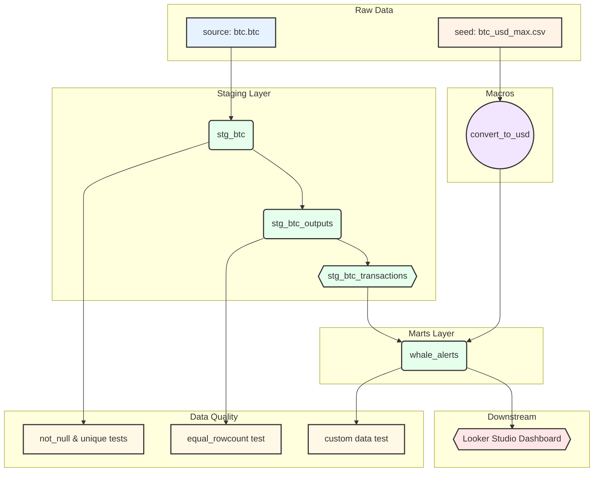

# BTC dbt Project Documentation

This project is designed to process Bitcoin transaction data within a Snowflake environment using dbt. It handles data ingestion from raw sources, flattens complex nested structures, and produces analytical models to identify "Whale" activities.

---

## ✨ Tech Stack

  
  
  
  
  
  
  

---

## 🗺️ Project Lineage

This graph illustrates the flow of data from raw sources to the final analytical models and exposures.

---

## ⚙️ 1. Project Configuration & Security

### `dbt_project.yml`
The core configuration file for the dbt project.
*   **Project Name:** `BTC`
*   **Profile:** Uses the `BTC` profile for connection settings.
*   **Model Paths:** Defines where dbt looks for models, seeds, macros, and tests.
*   **Marts Configuration:** Specifically configures models in the `marts` folder to materialize as tables and includes post-hooks for table commenting and versioned view creation.

### Access Keys & `profiles.yml`
*   **Why separate keys?** 🔐 Git is a version control system for code, not a secret manager. Committing database passwords or private keys to Git is a major security risk.
*   **How it works:** dbt uses a file called `profiles.yml` (typically stored in your local `~/.dbt/` directory, outside the project folder) to manage connection details (account, user, password, warehouse).
*   **Local vs. Git:** The `dbt_project.yml` references a profile name (e.g., `BTC`). When you run dbt locally, it looks up `BTC` in your local `profiles.yml`. In production (like GitHub Actions), secrets are injected via environment variables into a generated `profiles.yml`.

---

## 📚 2. Data Sources & Schema Definition

### `models/sources.yml`
*   **Purpose:** Defines the raw data loaded into Snowflake (e.g., `btc.btc_schema.btc`).
*   **Function:** Maps raw database tables to dbt "sources". This allows you to refer to them dynamically using `{{ source('btc', 'btc') }}` in your SQL, enabling lineage tracking and freshness checks.

### `models/schema.yml`
*   **Purpose:** The "contract" and documentation registry for your models.
*   **Key Components:**
    *   **Model Properties:** Defines descriptions and data types for columns.
    *   **Tests:** Applies constraints like `unique` and `not_null` to ensure data integrity.
    *   **Versioning:** Defines model versions (e.g., `whale_alerts` v1 vs v2), allowing you to introduce breaking changes (like removing a column) without immediately breaking downstream consumers.
    *   **Exposures:** Documents downstream dependencies (e.g., the "BTC Whale Alerts" Looker Studio dashboard), so you know what breaks if a model changes.

---

## 🏗️ 3. Models (`/models`)

The models are organized into layers following dbt best practices: Staging and Marts.

### Staging Layer (`/models/stg`)
This layer handles the initial cleaning and transformation of raw source data.

*   **`stg_btc.sql`**
    *   **Materialization:** Incremental (Merge strategy).
    *   **Purpose:** Acts as the entry point for raw Bitcoin data from the `btc.btc_schema.btc` source.
    *   **Logic:** It uses a `HASH_KEY` as a unique identifier and incrementally loads new data based on the `BLOCK_TIMESTAMP`.

*   **`stg_btc_outputs.sql`**
    *   **Materialization:** Incremental (Append strategy).
    *   **Purpose:** Bitcoin transactions often contain multiple outputs in a nested format. This model flattens that data.
    *   **Logic:** It uses Snowflake's `LATERAL FLATTEN` on the `outputs` column to create a row for every unique address/value pair in a transaction.

*   **`stg_btc_transactions.sql`**
    *   **Materialization:** Ephemeral (CTE-based, not created in the DB).
    *   **Purpose:** Filters the flattened outputs to focus on standard transactions.
    *   **Logic:** It excludes "Coinbase" transactions (newly minted coins) to focus on peer-to-peer transfers.

### Marts Layer (`/models/marts`)
The analytical layer where business logic is applied.

*   **`whale_alerts.sql`**
    *   **Materialization:** Table.
    *   **Purpose:** Identifies "Whales"—addresses involved in high-value transactions.
    *   **Logic:** 
        *   Filters for transactions where the output value is greater than 10 BTC.
        *   Aggregates data by `output_address` to show total sent and transaction counts.
        *   Uses a custom macro to calculate the USD value of the BTC sent.
    *   **Versioning:** This model supports multiple versions (v1 and v2) as defined in `schema.yml`.

---

## 🔧 4. Macros & Jinja (`/macros`)

Macros are reusable SQL/Jinja functions.

*   **`btc_utils.sql`**
    *   **`convert_to_usd(column_name)`:**
        *   **Function:** Accepts a column name (BTC value) as an argument.
        *   **Logic:** Joins with the `btc_usd_max` seed table on the current date to calculate the USD equivalent.
        *   **Jinja Usage:** `{{ convert_to_usd('w.total_sent') }}` injects the calculation logic directly into the compiled SQL.

---

## 🌱 5. Seeds (`/seeds`)

Seeds are CSV files that dbt loads into your data warehouse as tables.

*   **`btc_usd_max.csv`**
    *   **Purpose:** Provides historical and current BTC to USD exchange rates.
    *   **Usage:** Referenced by the `convert_to_usd` macro to provide financial context to transaction volumes.

---

## 🧪 6. Testing & Auditing

### Audit Schema
*   **What is it?** When dbt runs tests, it generates SQL queries that look for failing records.
*   **`dbt_test__audit`:** If you configure `store_failures: true`, dbt saves the failing records to a dedicated schema (e.g., `PROD_dbt_test__audit`). This allows you to inspect exactly *which* rows failed a test (e.g., seeing the specific duplicate `HASH_KEY`s).

---

## 🚀 7. CI/CD & Production Operations

### GitHub Actions (`dbt-ci.yml`)
*   **Purpose:** Automates code validation on Pull Requests.
*   **Workflow:**
    1.  **Trigger:** Runs on every push to a PR.
    2.  **Slim CI:** Often uses `dbt run --select state:modified+` to only run models that have changed, saving time and cost.
    3.  **Validation:** Executes `dbt test` to ensure changes don't violate data integrity rules before merging to `main`.

### Production Deployment
*   **Deployment:** When code merges to `main`, a production job runs `dbt build` against the production database/schema.
*   **Scheduling:** Jobs are typically scheduled (e.g., via dbt Cloud, Airflow, or Cron) to run at set intervals (e.g., every hour) to keep data fresh.

### Monitoring & Alerting
*   **Monitoring:** Use the dbt Cloud dashboard or Airflow UI to visualize job success/failure and duration.
*   **Alerting:**
    *   **Job Failure:** Configure email or Slack notifications if the `dbt run` command exits with a non-zero status.
    *   **Source Freshness:** Run `dbt source freshness` periodically. If raw data is stale (e.g., no new blocks in 2 hours), dbt can trigger an alert.

---

## 🗂️ 8. Project State (`/state`)

*   **`manifest.json`**
    *   A machine-generated file containing the full representation of the project's resources and their dependencies. It is used by dbt to understand the project structure and for state-based execution (e.g., `dbt build --state ...`).
